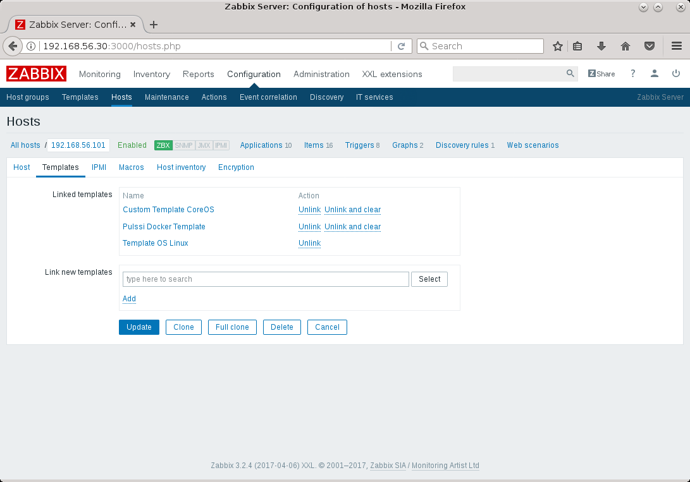
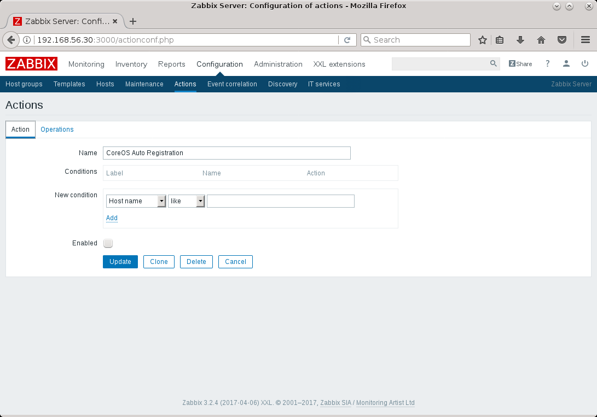
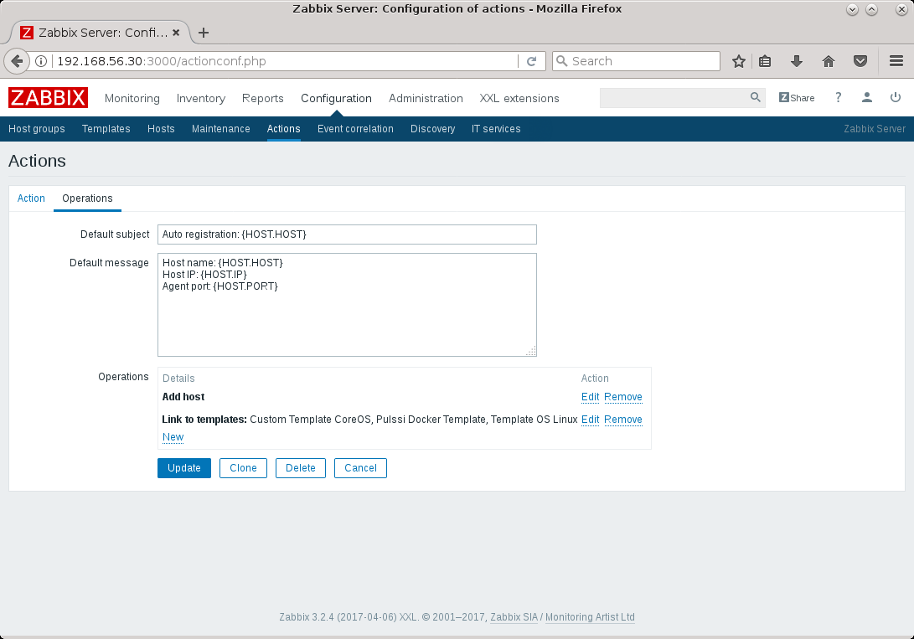
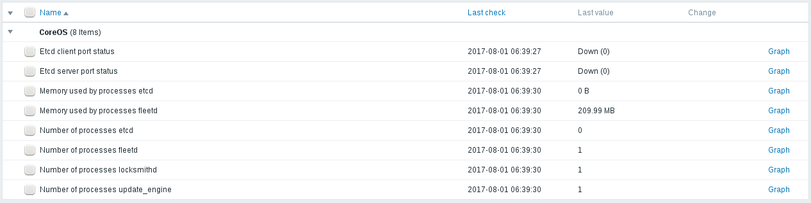
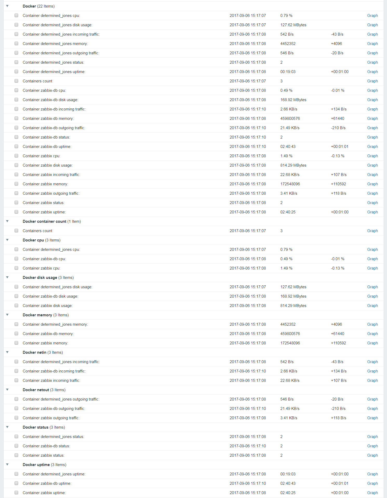
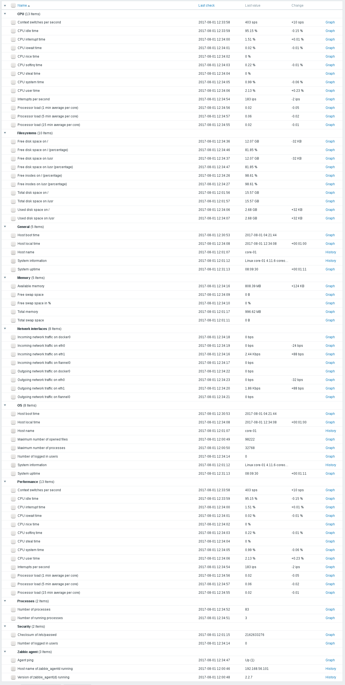

# docker-zabbix-coreos-pulssi
Dockerized Zabbix agent for CoreOS with docker process monitoring. Standard Linux
OS template items are supported as well as Core OS and Docker specific
monitoring templates provided within this project.

Based on [https://github.com/bhuisgen/docker-zabbix-coreos] and uses its
modified agent.

## Installation

You can configure monitored hosts either manually or using auto registration.
Auto registration can be useful if managing many (possibly transient) Core OS
hosts. Otherwise manual configuration is quite sufficient.

### Zabbix Server Configuration (Manual)

1. Import Zabbix templates under [templates](templates) to Zabbix server (needs to be done only once).
2. Create host in Zabbix server.
3. Apply templates to host as shown in example below. See [Template Items](#template-items) for description of supported templates.



### Zabbix Server Configuration (Auto Registration)

1. Import Zabbix templates under [templates](templates) to Zabbix server.
2. Create new auto registration action and configure it as shown in images below.





### Deploying the Zabbix Agent Container

Simple way to run the container is to use provided [hostname.conf](hostname.conf)
and [start.sh](start.sh). Copy these to CoreOS host and customize hostname.conf
if you need to specify additional parameters to Zabbix agent. Then execute
`start.sh` as follows:

```
./start.sh <zabbix-server> <hostname> [<host-metadata>]
```

Default for host-metadata is "coreos". If you use something else _and_
auto-registration, the server action condition must be modified accordingly.

*NOTE:* Passive checks are disabled by default for more secure setup - with it
agent container's network is separate from host and does not publish any ports.
The Linux OS template provided with Zabbix uses passive checks so you'll need
separate active version of it to use it without enabling passive checks for
agent.

#### Additional Options

To enable passive checks use *enable-passive* option:
```
./start.sh --enable-passive <zabbix-server> <hostname> [<host-metadata>]
```

To override the agent container name use *container-name* option:
```
./start.sh --container-name myagent <zabbix-server> <hostname> [<host-metadata>]
```

## Template Items

### CoreOS (Active)

*Template Name:* Custom Template CoreOS

CoreOS template requires enabling active monitoring.

* Etcd client port status
* Etcd server port status
* Memory used by processes etcd
* Memory used by processes fleetd
* Number of processes etcd
* Number of processes fleetd
* Number of processes locksmithd
* Number of processes update_engine



### Docker (Active/Passive)

*Template Name (Passive):* Pulssi Docker Template
*Template Name (Active):* Pulssi Docker Template (Active)

* Number of containers running in host
* Discovery of docker containers with following items
  * Status (1: not running, 2: running, 3: error)
  * Uptime
  * CPU usage
  * Disk usage
  * Memory usage
  * Incoming network traffic (eth0)
  * Outgoing network traffic (eth0)



Note that network traffic monitoring is based only on eth0 interface which won't
work if using `--net="host"` option for container and will not show all traffic
if additional network interfaces are created for container. Because enabling
passive checks currently requires using host networking for the agent container,
these items will not work for it at the same time.

### Linux OS Template

*Template Name (Passive):* Template OS Linux

Using default template included with Zabbix requires enabling active monitoring.



NOTE: The template's discovery functionality finds non-functioning items in
docker hosts (e.g. docker volumes are found as disks but monitoring them does
not actually work).
